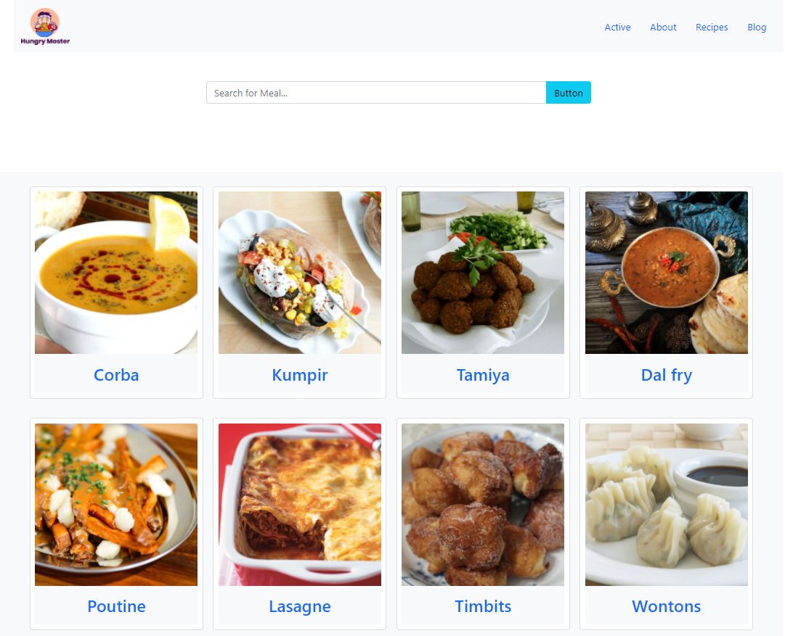

# Hungry Monster
Dynamic API based Restaurant Website

### `Technology Used`
- HTML5
- CSS3
- Bootstrap5
- Vanilla JavaScript

## :link: [view live project](https://samiul-sheikh.github.io/hungry-monstrar-api/)

### `Project Features`
1. User Interface is looking great.
2. users can easily search any food by name or name first letter.
3. display all matches food items in UI by searching keyword.
4. if users want to view which materials is used for cook this food just click on a food item.

### `Using API`
https://www.themealdb.com/

